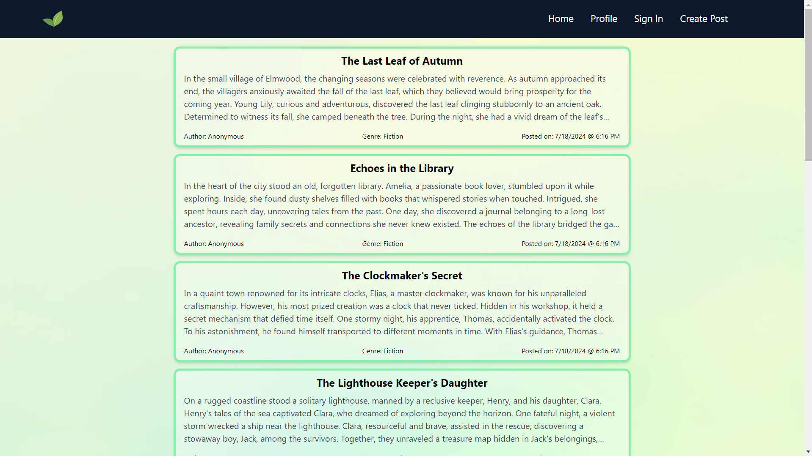
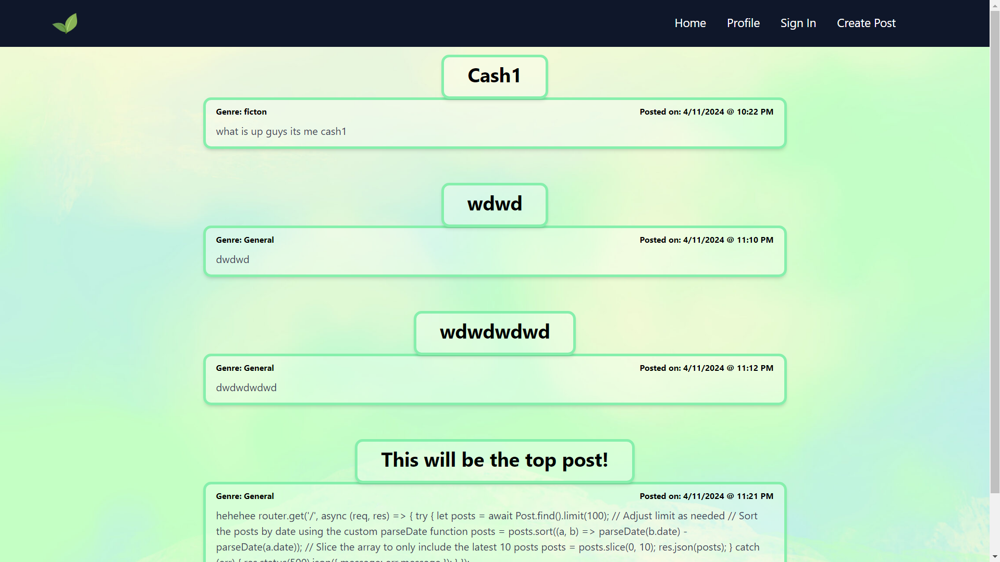
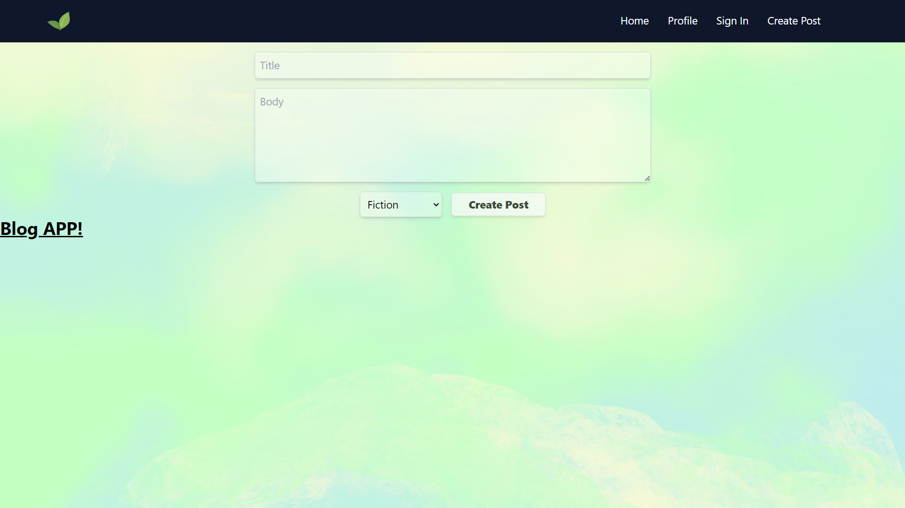
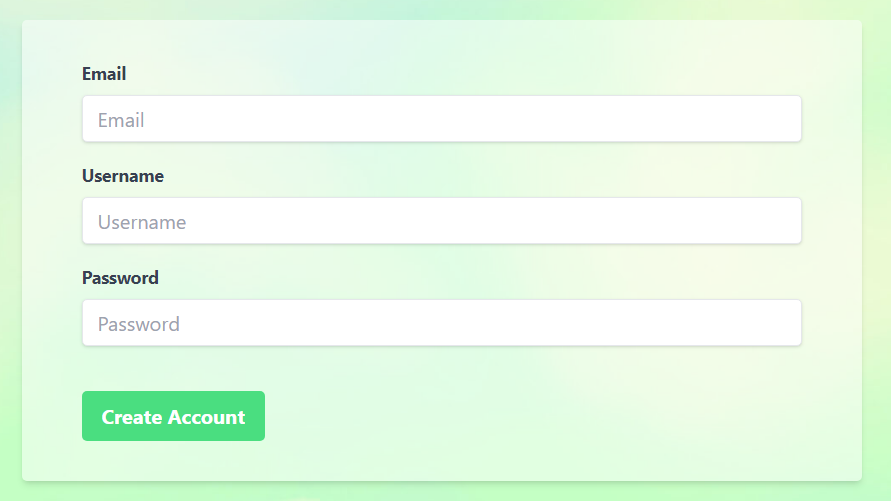
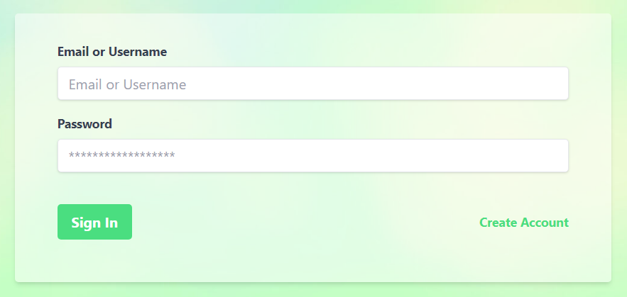

# 💻 Blog App!

## 📝 Project Overview

This app is a blogging platform developed using the MERN stack to help me learn some basics of modern web development. This application leverages popular libraries to create a simple frontend and backend for potential users. Users can create accounts, log in securely with encryption support, and manage their posts effortlessly. Each user has a personalized dashboard where they can view all their own blog posts.

## 🚀 Features

- User authentication with password encryption
- Ability to post anonymously or with a username after making an account
- User dashboard to see all posts with the associated account
- Each post gets a title, body, and genre which are all displayed on the front page

## 🛠️ Technology Used

- Mongo DB
- Express js
- React
- Node

## 📸 Screenshots

### Main Page

Dashboard           |  Create Post
:-------------------------:|:-------------------------:
  |  

Create Account             |  Sign In
:-------------------------:|:-------------------------:
  |  

